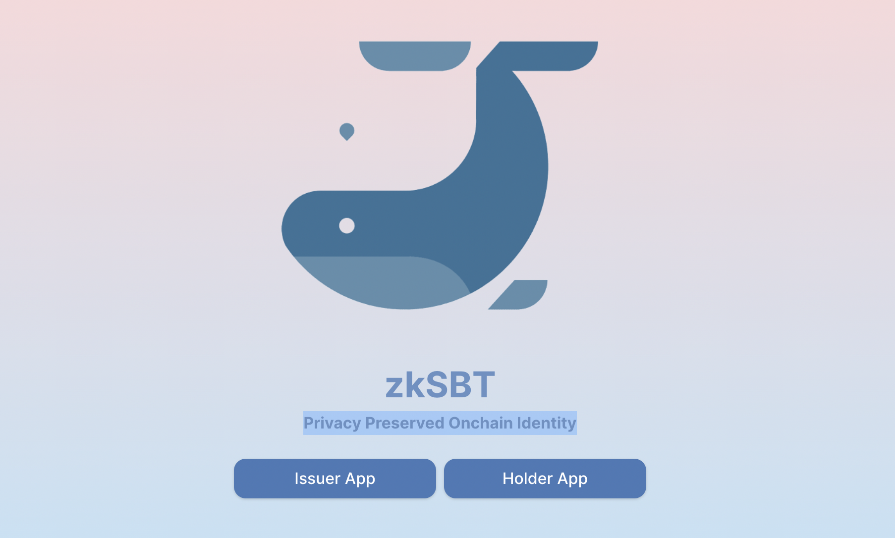
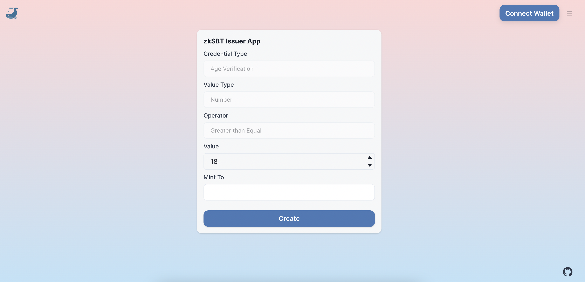
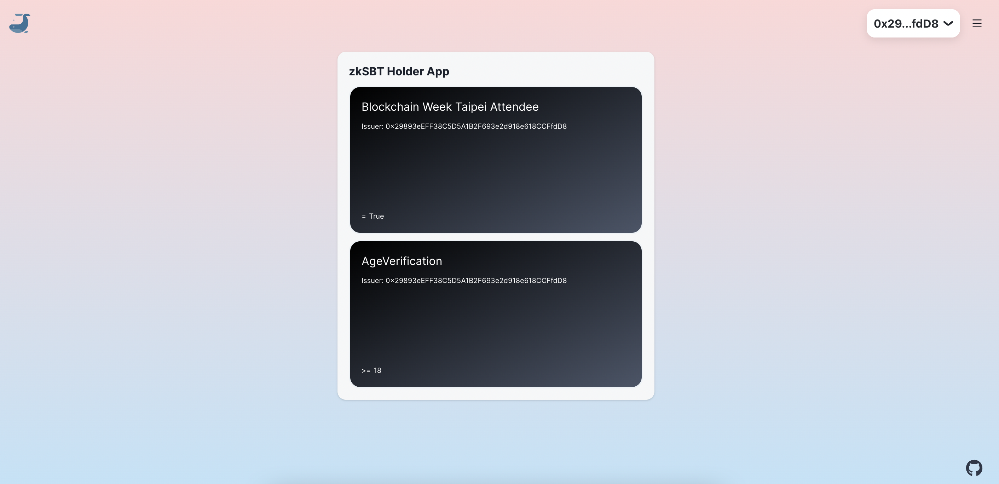
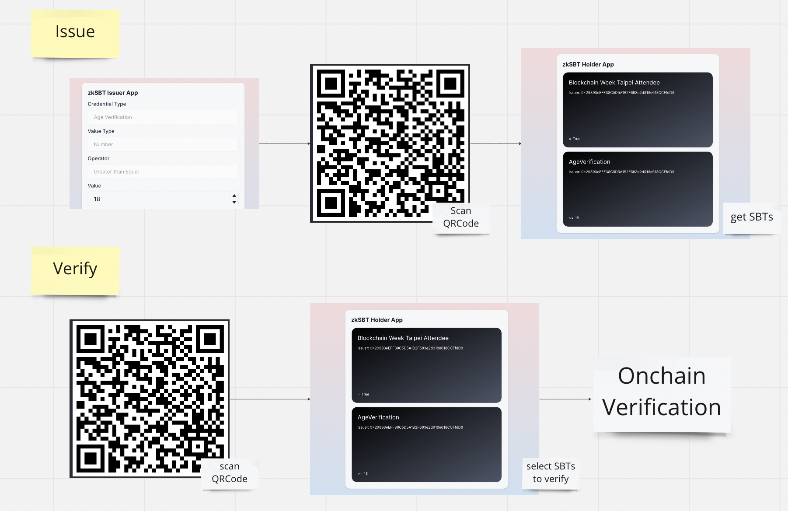
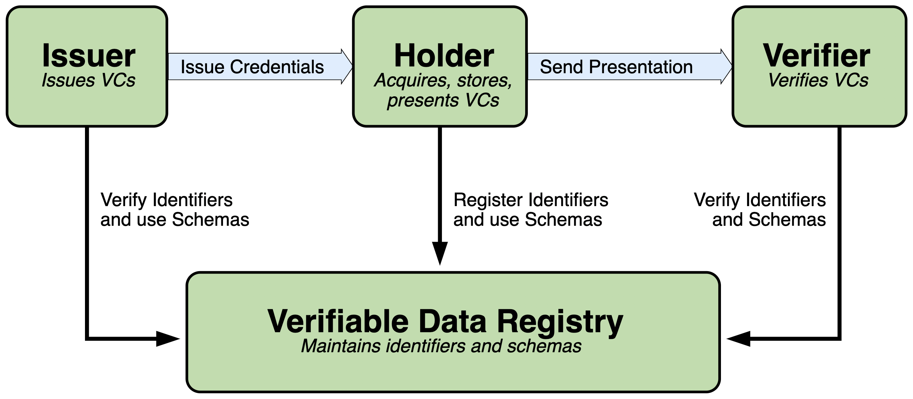
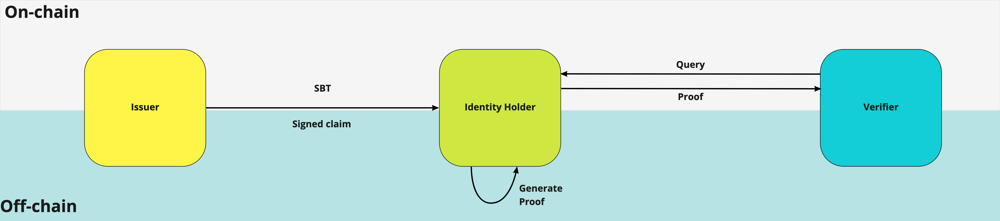

# zkSBT

zKSBT for Privacy-Preserved Onchain Identity

## Overview

zkSBT is an SBT issuer/holder/verifier app with ZKP.
Issuers can generate SBT and holders can hold the minted SBT, then the SBT can be verified on-chain.

We are leveraging ZKP, so the SBT is managed on-chain, but actual data is never disclosed to others.

## Submission

### Pitch Deck

https://docs.google.com/presentation/d/1xxOehKbgM_QP3lgP6JZ4cTB4VcvhXqJZxb83q-iR-Fg/edit?usp=sharing

### Live Demo

https://zk-sbt-five.vercel.app/

### Issuer

- Can create privacy-preserved SBTs using ZKP
- Can distribute the SBTs to target holders

### Holder

- Can display SBTs in the wallet
- Can verify the SBTs credential using ZKP

## QRCode Communication

### Issue

- The issuer generates QRCode and distributes it to the holder
- The holder scans QRCode
- The SBT is minted on-chain with ZKP

### Verify

- The verifier generates QRCode and distributes it to the holder
- The holder scans QRCode and submits the SBTs
- The SBT is verified on-chain with ZKP

## How It Works

### Verifiable Credential

- Credential management is using [W3C verifiable credential model](https://www.w3.org/TR/vc-data-model/#ecosystem-overview).
- We are using SBTs as a credential registry

### ZKP

- Our ZKP implementation is an extended version of [this repo](https://github.com/enricobottazzi/ZK-SBT) which leverages Iden3.
- Only signature hash is stored on-chain, and use ZKP for the verification

## Inspiration

### POAP and Kudos

We have a similar NFT distribution model with POAP and Kudos. POAP is proof of attendance and Kudos is the SBT version of POAP.
Our service provides more flexible credential types and leverages ZKP for user privacy.

### Polygon ID

We have a similar credential model with Polygon ID. Polygon ID is a verifiable credential management tool with ZKP and the credential is issued off-chain but verifiable on-chain.
Our service provides issue credential on-chain for better composability and still preserve user privacy with ZKP.

### Composability

We are not being the competitor of those existing great services.
We can have zkSBT gateway for the above services so that we can access the existing user base too.

## Technical Challenge

For the smart contract implementation, we leveraged existing ZKP smart contract implementation.

We focused on better UX with issuing, holding, and verifying zkSBT to make it usable in the actual use case.

### Main Reference

https://github.com/enricobottazzi/ZK-SBT

https://github.com/SpartanLabsXyz/zk-sbt

## Deployed Contract

### PrivateSoulMinter

https://goerli.etherscan.io/address/0xF6F9B3aF9Bef3239F2eBD3ce0B62087275Cc4b36#code

### Verifier

https://goerli.etherscan.io/address/0xAe1386449EE2b157B3e55F34bC24Cc699c2b8232#code
